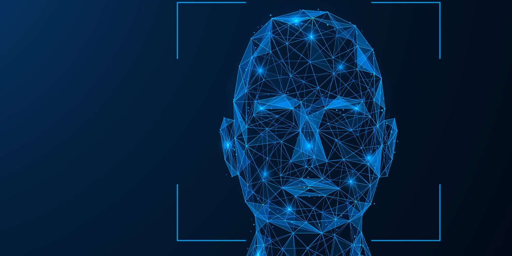

<!-- Placeholder -->

# Code Breakdown: Face Detection Script for Local VSCode Environment

This breakdown covers the step-by-step explanation of a face detection script designed to run in a local environment such as Visual Studio Code using OpenCV.

### 1. **Imports and Dependencies**

The script starts by importing necessary libraries:
- `imutils`: Simplifies image processing tasks like resizing.
- `numpy`: Handles numerical operations, including coordinate manipulation.
- `cv2`: OpenCV library used for image processing, neural network loading, and display functions.

```python
import imutils
import numpy as np
import cv2
```

### 2. detect_faces() Function
This is the core function responsible for detecting faces in the provided image.

Function Definition
```python
def detect_faces(image_path):
```
image_path: Accepts the file path of the image as an argument.

Step 1: Load the Pre-Trained Face Detection Model
```python
prototxt = 'deploy.prototxt'  
model = 'res10_300x300_ssd_iter_140000.caffemodel'
net = cv2.dnn.readNetFromCaffe(prototxt, model)
```

prototxt: Defines the architecture of the deep learning model.
model: Contains pre-trained weights for face detection.
cv2.dnn.readNetFromCaffe: Loads the Caffe model (both structure and weights) into OpenCV’s DNN module for use.

Step 2: Read and Resize the Image
```python
Copy code
image = cv2.imread(image_path)
image = imutils.resize(image, width=400)
(h, w) = image.shape[:2]
```
cv2.imread(): Reads the image from the given file path.
imutils.resize(): Resizes the image to a width of 400 pixels to speed up processing while maintaining aspect ratio.
(h, w): Captures the height and width of the image for later use in drawing bounding boxes.

Step 3: Create a Blob from the Image

```python
Copy code
blob = cv2.dnn.blobFromImage(cv2.resize(image, (300, 300)), 1.0, (300, 300), (104.0, 177.0, 123.0))
Blob: A blob is a 4D array of the image used as input for the neural network. It's resized to 300x300, which is the input size expected by the model.
```
The last three values (104.0, 177.0, 123.0) are mean subtraction values for preprocessing.

Step 4: Pass the Blob Through the Network
```python
Copy code
net.setInput(blob)
detections = net.forward()
```
net.setInput(): Feeds the blob into the neural network.
net.forward(): Runs the forward pass of the network, giving a set of face detections in the image.

Step 5: Loop Over Detections and Draw Bounding Boxes
```python
Copy code
for i in range(0, detections.shape[2]):
    confidence = detections[0, 0, i, 2]
    if confidence > 0.5:
        box = detections[0, 0, i, 3:7] * np.array([w, h, w, h])
        (startX, startY, endX, endY) = box.astype("int")
        text = "{:.2f}%".format(confidence * 100)
        y = startY - 10 if startY - 10 > 10 else startY + 10
        cv2.rectangle(image, (startX, startY), (endX, endY), (0, 0, 255), 2)
        cv2.putText(image, text, (startX, y), cv2.FONT_HERSHEY_SIMPLEX, 0.45, (0, 0, 255), 2)
```
confidence: Extracts the confidence score for each detected face. If it's greater than 50%, the detection is considered valid.
Bounding Box: The detection results contain coordinates for a box around the face. These are scaled according to the image’s original dimensions (w, h).
cv2.rectangle(): Draws the bounding box around the detected face.
cv2.putText(): Adds a text label showing the confidence percentage above the bounding box.

### 3. Main Script Execution
This section handles running the script locally, detecting faces, and displaying the result in a window.

Step 6: Run Face Detection
```python
Copy code
if __name__ == "__main__":
  image_with_faces = detect_faces('path/to/your/image.jpg')
```
if __name__ == "__main__":: Ensures the script runs only if it's executed directly, not when imported as a module.
detect_faces(): Calls the face detection function, providing the path to an image file.

### Step 7: Display the Image
```python
Copy code
cv2.imshow("Faces Detected", image_with_faces)
cv2.waitKey(0)
cv2.destroyAllWindows()
```
cv2.imshow(): Displays the image in a window titled "Faces Detected".
cv2.waitKey(0): Waits indefinitely until a key is pressed, allowing time to view the output.
cv2.destroyAllWindows(): Closes the display window when the script is finished.

### Summary
This script provides an end-to-end process for detecting faces in an image using a pre-trained deep learning model in OpenCV. The key steps include:

- Loading the image.
- Preprocessing it into a blob for the neural network.
- Detecting faces.
- Drawing bounding boxes around detected faces.
- Displaying the result locally in a window using OpenCV’s GUI functions.
- By replacing 'path/to/your/image.jpg' with the correct image path, you can easily run face detection on any image in your local environment.
